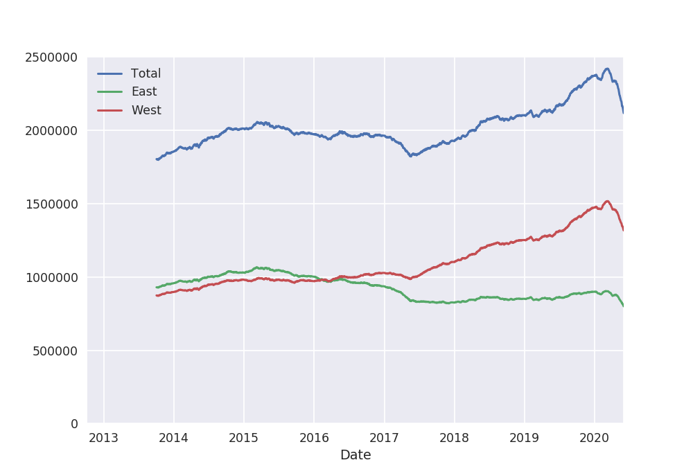

# Transportation

Goal:
-To make inferences about the work habits of Seattle residents who commute by bicycle

Overview:

Links:
https://jakevdp.github.io/blog/2015/07/23/learning-seattles-work-habits-from-bicycle-counts/

Credits:
Jake Vanderplas
